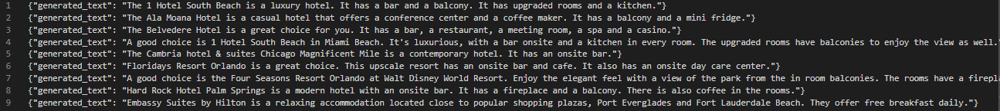

# SmartDescriptions  - AWS Marketplace Algoritm

**SmartDescriptions** is a data-to-text solution that allows you to generate text from structured data. With the SmartDescriptions solution you can save time by generating
thousands of comprehensible texts automatically.

**SmartDescriptions** allows you to:

- **Increase** content generation
- **Mantain** content quality
- **Conserve** human energy
- **Prepare grounds** for personalization at scale

## How does the solution work?

You can implement the SmartDescriptions Algorithm from AWS Marketplace and execute the notebook to train the model with your data and consume the solution in two ways:

1. Real-time: A SageMaker endpoint is deployed to consume the solution in real-time [See SmartDescriptions Notebook](./SmartDescriptions.ipynb)
2. Batch process: Multiple input payloads are processed together through a batch job [See SmartDescriptions Notebook](./SmartDescriptions.ipynb)