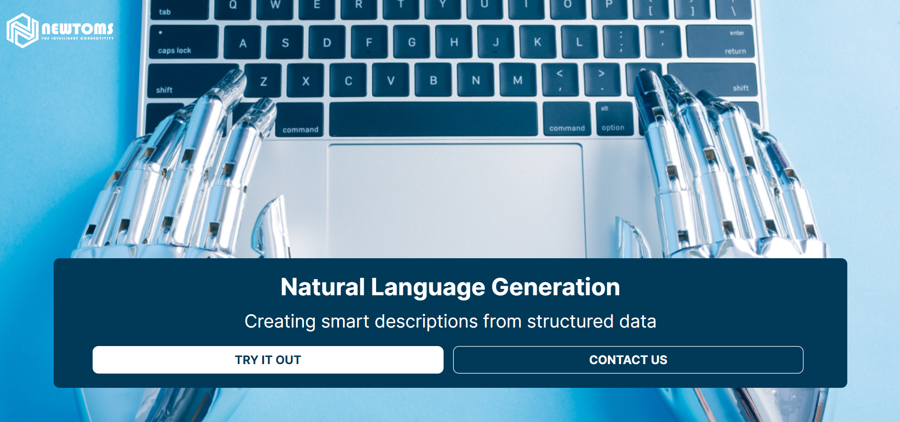
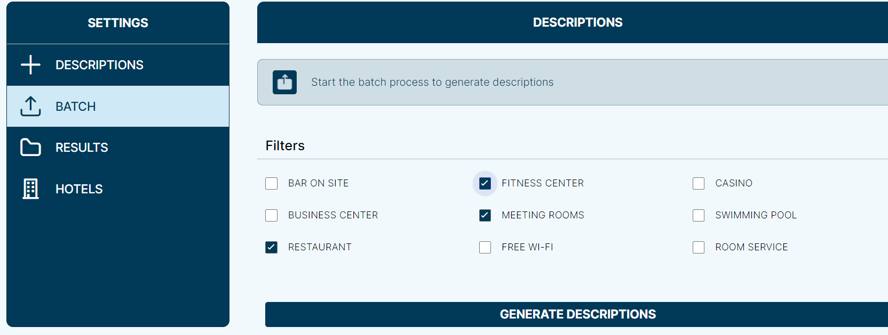

# SmartDescriptions  - AWS Marketplace Algoritm

**SmartDescriptions** is a data-to-text solution that allows you to generate text from structured data. With the SmartDescriptions solution you can save time by generating
thousands of comprehensible texts automatically.

**SmartDescriptions** allows you to:

- **Increase** content generation
- **Mantain** content quality
- **Conserve** human energy
- **Prepare grounds** for personalization at scale

